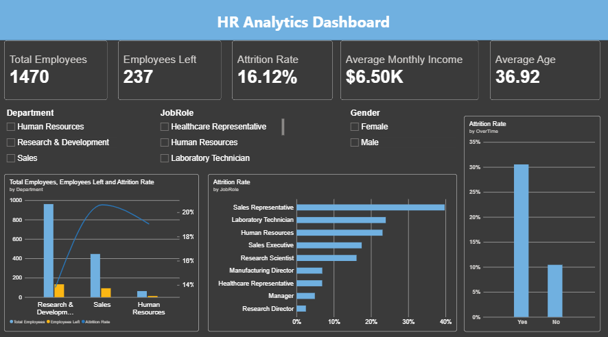
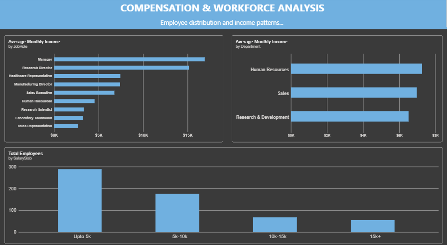
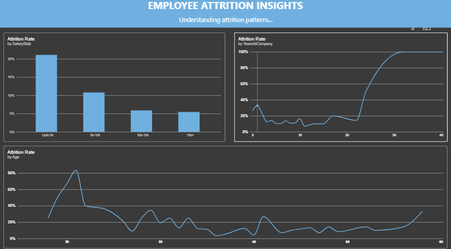
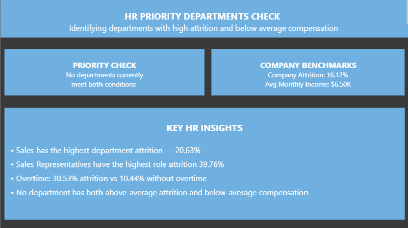

# HR Analytics — Employee Attrition

## 📌 Project Overview

An end-to-end HR Analytics project focused on understanding employee attrition, workforce patterns, compensation, and departmental performance.

The project combines **Power Query, SQL Server, and Power BI** to transform raw HR data into meaningful business insights that can support HR decision-making.

---

## 🎯 Business Objective

The objective of this project is to analyze employee data and answer key HR business questions, including:

* How is the workforce distributed across departments?
* How does compensation vary across departments and employees?
* Which departments and job roles experience higher attrition?
* Does attrition differ across salary levels?
* How does overtime relate to employee attrition?
* How does attrition change as employees spend more years at the company?
* Which departments show both high attrition and below-company-average compensation?

---

## 🗂️ Dataset

The project uses an HR employee dataset containing information related to:

* Employee demographics
* Department and job role
* Compensation
* Job level
* Work experience
* Overtime
* Job satisfaction
* Attrition
* Years at company
* Other employee-related attributes

The cleaned dataset contains **1,470 employee records**.

---

# 🧹 Data Cleaning — Power Query

Power Query was used to prepare the dataset for analysis.

### Key Cleaning Activities

**Duplicate Removal**

* Identified and removed duplicate employee records.
* Employee identifiers were used to verify uniqueness.

**Unnecessary Columns**
Removed columns that provided no analytical value:

* `EmployeeCount`
* `Over18`
* `StandardHours`
* `AgeGroup`

**Category Standardization**

Inconsistent categorical values were standardized, including:

* `TravelRarely` → `Travel_Rarely`
* `Not-Travel` → `Not_Travel`

**Missing Values**

The `YearsWithCurrManager` field contained 57 missing values.

Rather than removing valid employees, the missing values were retained and identified using a validation column.

### Final Validation

| Validation                     | Result |
| ------------------------------ | -----: |
| Total employee records         |  1,470 |
| Valid records                  |  1,413 |
| Missing `YearsWithCurrManager` |     57 |
| Invalid records                |      0 |

Numerical fields were also investigated and validated to ensure the data was suitable for analysis.

---

# 🧮 SQL Analysis

SQL Server was used to perform structured business analysis on the cleaned HR dataset.

The SQL analysis is organized into four areas:

### Workforce Analysis

Analysis of:

* Employee distribution by department
* Workforce size
* Employee characteristics
* Department-level workforce patterns

### Compensation Analysis

Analysis of:

* Average monthly income by department
* Salary levels
* Highest-paid employees
* Employees earning above department averages
* Employees earning above the company average
* Employees earning more than twice the company average

### Attrition Analysis

Analysis of:

* Employee attrition
* Attrition by department
* Attrition by salary slab
* Attrition by job role
* Attrition by overtime
* Attrition by years at company

### Advanced Analysis

More advanced SQL techniques were used for:

* Employee ranking within departments
* Department-level income comparisons
* Company-wide benchmarking
* Identifying departments with higher-than-company attrition
* Identifying departments with both high attrition and below-company-average income

SQL techniques used include:

* Aggregations
* `GROUP BY`
* `HAVING`
* `CASE`
* Subqueries
* Common Table Expressions
* Window functions
* `RANK`
* `DENSE_RANK`
* `ROW_NUMBER`

---

# 📊 Power BI Dashboard

The final Power BI dashboard contains four analytical pages.

### 1. HR Overview

Provides a high-level view of the organization's workforce and key HR metrics.

### 2. Compensation & Workforce Analysis

Explores workforce distribution and compensation patterns across the organization.

### 3. Attrition Trends

Analyzes employee attrition across different HR dimensions, including department, salary level, job role, overtime, and years at company.

### 4. Priority Department Check

Provides a deeper departmental analysis to identify areas that may require HR attention, including comparisons between attrition and compensation.

---

# 💡 Key HR Insights

The analysis focuses on identifying patterns that can help HR teams:

* Monitor departments with elevated attrition.
* Understand how attrition varies across salary levels.
* Examine the relationship between overtime and employee turnover.
* Identify job roles with notable attrition patterns.
* Compare departmental compensation with company-wide benchmarks.
* Identify departments that may require further investigation due to the combination of higher attrition and lower compensation.

These insights are intended to support further HR investigation and data-driven decision-making rather than serve as standalone explanations for employee turnover.

---

# 🛠️ Tools & Technologies

| Tool            | Purpose                                      |
| --------------- | -------------------------------------------- |
| **Power Query** | Data cleaning and transformation             |
| **SQL Server**  | Data analysis and business queries           |
| **Power BI**    | Data visualization and dashboard development |
| **GitHub**      | Project documentation and portfolio          |

---

# 📁 Project Structure

```text
HR-Analytics-Employee-Attrition
│
├── Data
│
├── PowerBI
│   └── HR_Analytics_Dashboard.pbix
│
├── Power_Query
│   └── README.md
│
├── Screenshots
│   ├── 01_HR_Overview.png
│   ├── 02_Compensation_Workforce.png
│   ├── 03_Attrition_Trends.png
│   └── 04_Priority_Department_Check.png
│
├── HR_Analytics_Business_Queries.sql
│
└── README.md
```

---

# 📸 Dashboard Preview

### HR Overview



### Compensation & Workforce Analysis



### Attrition Trends



### Priority Department Check



---

# 🚀 Project Outcome

This project demonstrates an end-to-end data analytics workflow:

**Raw HR Data → Power Query Cleaning → SQL Analysis → Power BI Dashboard → Business Insights**

It combines data preparation, SQL analysis, analytical thinking, visualization, and business-focused interpretation into one complete HR Analytics project.

